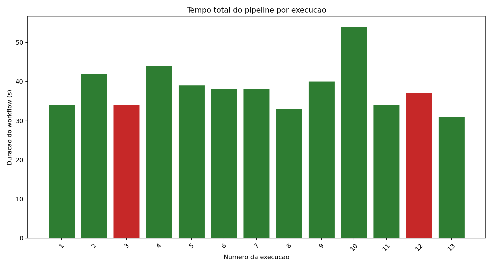
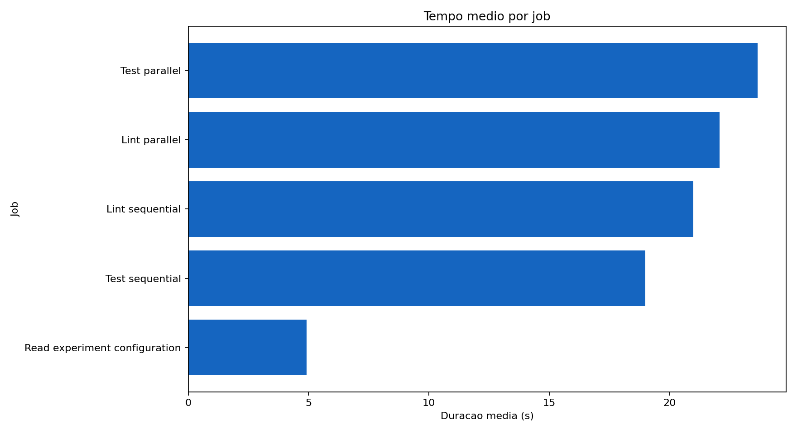
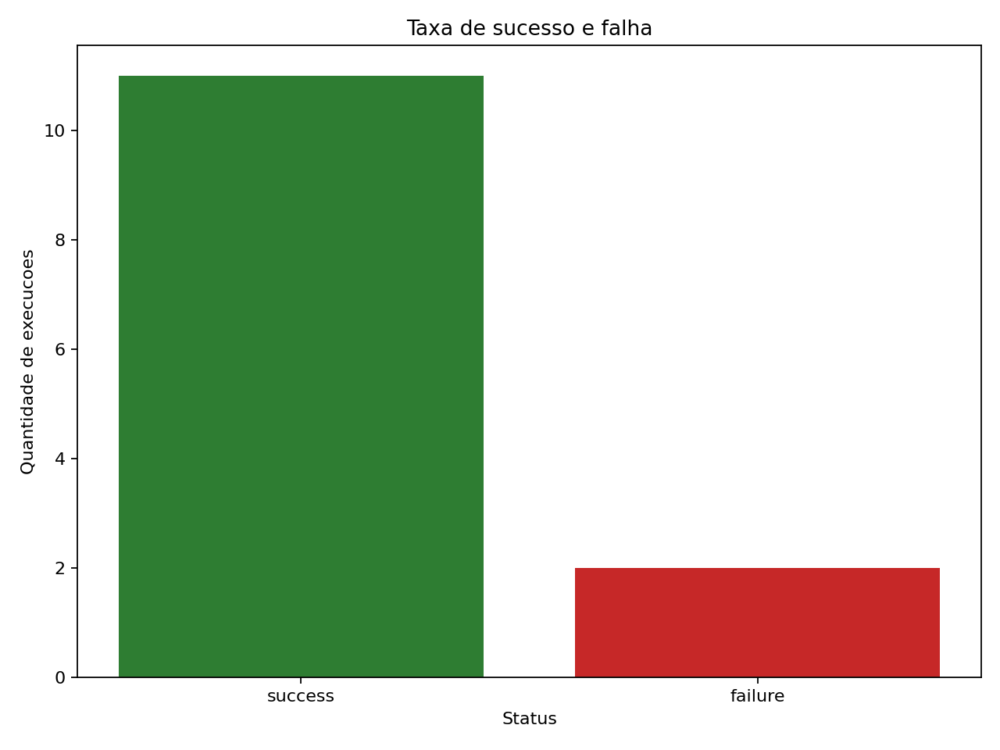
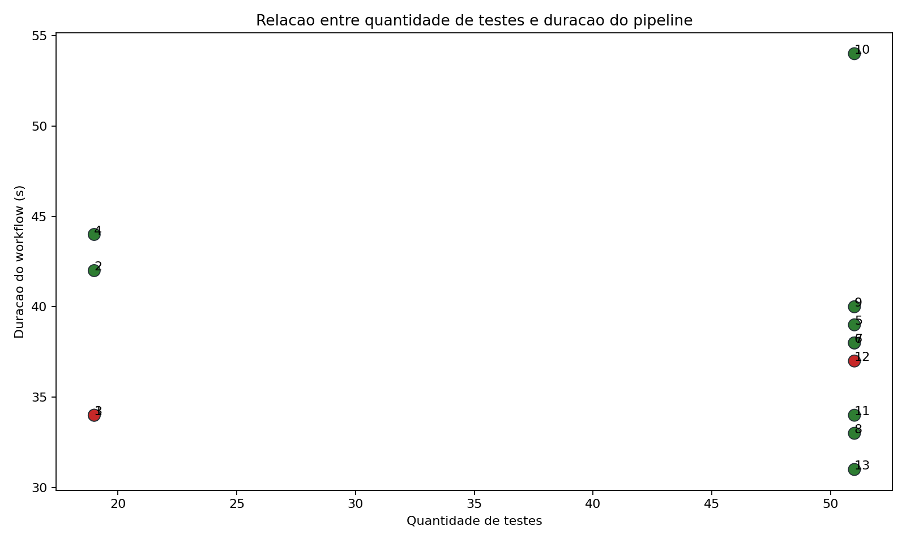

# Relatorio Tecnico do Experimento CI/CD

## 1. Objetivo

Medir e analisar o comportamento de um pipeline CI/CD executado no GitHub
Actions a partir de execucoes reais, coletando metricas de duracao, estabilidade,
falhas, volume de testes e impacto de configuracoes como cache e paralelismo.

## 2. Projeto analisado

O projeto utilizado e uma biblioteca Python simples chamada `task_metrics`.
Ela calcula estatisticas de tarefas, como quantidade total, quantidade por
status, percentual de conclusao e prioridade media.

Repositorio:

- Link: <https://github.com/JoaoGuilhermeSalomao/pond-m10-s7>

Workflow principal:

- YAML do CI: <https://github.com/JoaoGuilhermeSalomao/pond-m10-s7/blob/main/.github/workflows/ci.yml>
- YAML do CD: <https://github.com/JoaoGuilhermeSalomao/pond-m10-s7/blob/main/.github/workflows/cd.yml>

## 3. Pipeline implementado

O pipeline de CI executa:

1. leitura da configuracao do experimento;
2. instalacao de dependencias;
3. lint com Ruff;
4. testes automatizados com Pytest;
5. geracao de relatorios JUnit e JSON;
6. upload de artefatos;
7. execucao em modo paralelo ou sequencial.

O pipeline de CD executa um deploy simulado apos sucesso do CI e publica um
artefato contendo o resumo do deploy.

## 4. Hipotese inicial

Hipotese inicial:

> O uso de cache deve reduzir o tempo de instalacao de dependencias, o aumento
> da quantidade de testes deve elevar a duracao total do pipeline e a execucao
> paralela deve ser mais rapida que a sequencial quando lint e testes puderem
> rodar de forma independente.

## 5. Variacoes executadas

Foram realizadas 13 execucoes reais. As 12 primeiras cobrem o minimo exigido
pela atividade; a execucao 13 foi adicionada para restaurar o pipeline para um
estado verde apos a segunda falha controlada.

| Execucao | Run ID | Commit SHA | Mensagem do commit | Status | Variacao | Link |
|---|---|---|---|---|---|---|
| 1 | `27079368005` | `05e9b6e` | run 01: baseline without cache | success | Baseline sem cache | [link](https://github.com/JoaoGuilhermeSalomao/pond-m10-s7/actions/runs/27079368005) |
| 2 | `27079373834` | `e1f8c42` | run 02: enable dependency cache | success | Cache habilitado | [link](https://github.com/JoaoGuilhermeSalomao/pond-m10-s7/actions/runs/27079373834) |
| 3 | `27079376371` | `3b2b1e8` | run 03: introduce controlled failing test | failure | Teste falhando | [link](https://github.com/JoaoGuilhermeSalomao/pond-m10-s7/actions/runs/27079376371) |
| 4 | `27079379103` | `109214c` | run 04: fix controlled failing test | success | Correcao da falha | [link](https://github.com/JoaoGuilhermeSalomao/pond-m10-s7/actions/runs/27079379103) |
| 5 | `27079381187` | `dab7163` | run 05: increase generated test cases | success | Mais testes | [link](https://github.com/JoaoGuilhermeSalomao/pond-m10-s7/actions/runs/27079381187) |
| 6 | `27079383619` | `d7bbafd` | run 06: add slow test delay | success | Teste lento | [link](https://github.com/JoaoGuilhermeSalomao/pond-m10-s7/actions/runs/27079383619) |
| 7 | `27079386981` | `901e522` | run 07: remove slow test delay | success | Sem teste lento | [link](https://github.com/JoaoGuilhermeSalomao/pond-m10-s7/actions/runs/27079386981) |
| 8 | `27079389899` | `62690bc` | run 08: disable dependency cache | success | Cache desabilitado | [link](https://github.com/JoaoGuilhermeSalomao/pond-m10-s7/actions/runs/27079389899) |
| 9 | `27079392324` | `c57a38f` | run 09: re-enable dependency cache | success | Cache reabilitado | [link](https://github.com/JoaoGuilhermeSalomao/pond-m10-s7/actions/runs/27079392324) |
| 10 | `27079395545` | `6be8410` | run 10: switch jobs to sequential mode | success | Jobs sequenciais | [link](https://github.com/JoaoGuilhermeSalomao/pond-m10-s7/actions/runs/27079395545) |
| 11 | `27079397897` | `d0febde` | run 11: switch jobs back to parallel mode | success | Jobs paralelos | [link](https://github.com/JoaoGuilhermeSalomao/pond-m10-s7/actions/runs/27079397897) |
| 12 | `27079401855` | `d3b9f5f` | run 12: introduce second controlled failing test | failure | Nova falha controlada | [link](https://github.com/JoaoGuilhermeSalomao/pond-m10-s7/actions/runs/27079401855) |
| 13 | `27079405132` | `d407875` | run 13: restore green pipeline state | success | Estado final verde | [link](https://github.com/JoaoGuilhermeSalomao/pond-m10-s7/actions/runs/27079405132) |

## 6. Coleta de metricas

A coleta foi feita por script proprio em Python, localizado em
`scripts/collect_metrics.py`.

O script consulta a API do GitHub Actions, coleta workflow runs, jobs, steps,
commits e artefatos de teste. A base gerada foi:

- CSV: `metrics/pipeline_metrics.csv`
- JSON: `metrics/pipeline_metrics.json`

Campos principais coletados:

- `run_id`;
- `commit_sha`;
- `commit_message`;
- `status`;
- `workflow_duration`;
- `job_name`;
- `job_duration`;
- `step_name`;
- `step_duration`;
- `test_count`;
- `test_failures`;
- `average_test_time`;
- `timestamp`;
- `run_url`.

## 7. Graficos gerados

## 8. Analise dos resultados

### 8.1 Qual etapa mais contribuiu para o tempo total do pipeline?

A instalacao de dependencias foi o principal gargalo. A soma das etapas
`Install dependencies` ficou tipicamente entre 27 e 39 segundos por execucao,
enquanto `Run tests` variou de 0 a 3 segundos nos dados coletados. Mesmo quando
foi adicionado um teste lento na execucao 6, a etapa de instalacao continuou
sendo mais relevante para a duracao total.

### 8.2 Houve diferenca significativa entre execucoes com e sem cache?

Nao houve reducao consistente no tempo total. A execucao 1, sem cache, levou
34 segundos, enquanto a execucao 2, com cache habilitado, levou 42 segundos. Na
comparacao posterior, a execucao 8, sem cache, levou 33 segundos, e a execucao
9, com cache reabilitado, levou 40 segundos.

O cache reduziu ou estabilizou parte da instalacao em alguns casos, mas o custo
de restaurar/salvar cache e a variabilidade do ambiente do GitHub Actions
impediram ganho claro no tempo total para este projeto pequeno.

### 8.3 O paralelismo reduziu o tempo total? Em que condicoes?

Sim. A execucao 10, com jobs sequenciais, levou 54 segundos. A execucao 11,
com jobs paralelos e a mesma quantidade de testes, levou 34 segundos. A reducao
foi de 20 segundos.

O paralelismo foi vantajoso porque lint e testes eram independentes. Quando
esses jobs rodam ao mesmo tempo, o tempo total se aproxima do job mais lento,
em vez da soma dos dois.

### 8.4 Quais falhas foram mais frequentes?

As duas falhas observadas foram falhas controladas de teste:

- execucao 3: `FORCE_TEST_FAILURE=true`;
- execucao 12: `FORCE_TEST_FAILURE=true`.

Nao houve falhas de instalacao, lint, cache ou upload de artefatos nas
execucoes coletadas.

### 8.5 O pipeline fornece feedback rapido o suficiente para o desenvolvedor?

Sim, para este projeto. As execucoes ficaram entre 31 e 54 segundos. Mesmo a
execucao mais lenta, em modo sequencial, ficou abaixo de 1 minuto. Para um
projeto pequeno, esse tempo fornece feedback rapido o suficiente.

Em um projeto maior, a instalacao de dependencias e a duplicacao dessa etapa em
mais de um job poderiam se tornar um problema.

### 8.6 Que melhorias poderiam ser feitas no pipeline?

As principais melhorias seriam:

- evitar instalacao duplicada de dependencias quando isso nao trouxer ganho de
  paralelismo suficiente;
- manter lint e testes em paralelo para feedback mais rapido;
- investigar uma estrategia de cache mais eficiente;
- executar lint antes de testes caros em cenarios sequenciais;
- monitorar duracao historica para detectar regressao de performance;
- separar testes rapidos e lentos caso a suite cresca.

### 8.7 Quais limitacoes existem nos dados coletados?

As principais limitacoes sao:

- apenas 13 execucoes, uma amostra pequena;
- ambiente do GitHub Actions e compartilhado e pode variar;
- o projeto e pequeno e nao representa totalmente pipelines reais maiores;
- as falhas foram artificiais e controladas;
- tempos muito curtos de teste ficam proximos da resolucao minima registrada;
- cache pode se comportar de forma diferente em projetos com dependencias
  maiores.

### 8.8 Como essa analise poderia apoiar decisoes de engenharia?

A analise ajuda a decidir onde otimizar o pipeline. Neste caso, os dados indicam
que o maior retorno viria de reduzir ou reaproveitar a instalacao de
dependencias e manter jobs independentes em paralelo. Tambem mostra que o
pipeline tem feedback rapido, mas que o cache nao deve ser assumido como ganho
automatico sem medicao.

## 9. Resultados inesperados

### Resultado inesperado 1: cache nao reduziu o tempo total

- Esperado: execucoes com cache seriam mais rapidas.
- Observado: a execucao 2 com cache levou 42 segundos contra 34 segundos da
  execucao 1 sem cache; a execucao 9 com cache levou 40 segundos contra 33
  segundos da execucao 8 sem cache.
- Evidencia nos dados: `workflow_duration` das execucoes 1, 2, 8 e 9.
- Possivel explicacao: o projeto tem poucas dependencias, e o custo de
  restaurar/salvar cache somado a variabilidade do ambiente anulou o ganho.

### Resultado inesperado 2: aumentar testes nao aumentou o tempo total

- Esperado: passar de 19 para 51 testes aumentaria a duracao do workflow.
- Observado: a execucao 4, com 19 testes, levou 44 segundos; a execucao 5, com
  51 testes, levou 39 segundos.
- Evidencia nos dados: `test_count` e `workflow_duration` das execucoes 4 e 5.
- Possivel explicacao: os testes sao muito pequenos; o tempo total foi dominado
  por instalacao de dependencias e inicializacao dos jobs, nao pelo tempo da
  suite de testes.

## 10. Comparacao entre hipotese inicial e resultado observado

A hipotese foi parcialmente confirmada.

Foi confirmado que o paralelismo reduziu o tempo total: 54 segundos no modo
sequencial contra 34 segundos no modo paralelo. Tambem foi confirmado que um
teste lento aumenta o tempo medio dos testes: a execucao 6 registrou
`average_test_time` de 0,060706 segundo, maior que as execucoes equivalentes sem
delay.

Por outro lado, o cache nao reduziu o tempo total de forma consistente, e o
aumento da quantidade de testes nao elevou a duracao total. Isso mostra que,
neste projeto, o gargalo nao estava nos testes, mas na preparacao do ambiente.

## 11. Como reproduzir

1. Clonar o repositorio.
2. Instalar as dependencias com `python -m pip install -r requirements.txt`.
3. Alterar `experiment/variation.env` conforme as variacoes documentadas no
   `README.md`.
4. Criar um commit para cada variacao.
5. Enviar cada commit para o GitHub.
6. Aguardar as execucoes do GitHub Actions.
7. Rodar `scripts/collect_metrics.py` para gerar CSV e JSON.
8. Rodar `scripts/generate_charts.py` para gerar os graficos.
9. Revisar este relatorio com os dados atualizados.

